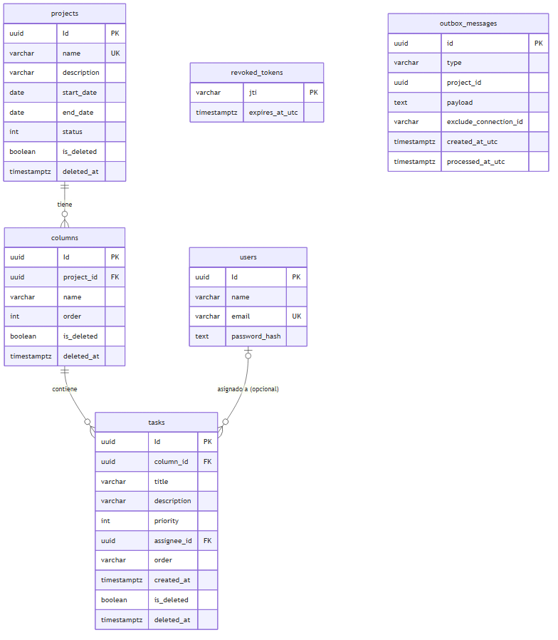

# GestiónProyectos — Prueba Técnica IDEASGROUP-REM-LAT-26-2907

Aplicativo web para la gestión de proyectos ágiles: proyectos, columnas configurables y tablero kanban con tiempo real, sobre .NET 8 (arquitectura hexagonal) + Angular 17 (PrimeNG/Sakai) + PostgreSQL.

> Documento vivo, se actualiza en paralelo al desarrollo (no se escribe al final). Última actualización: 2026-08-02, al cierre de los obligatorios de la Fase 6.

---

## Índice

1. [Estado del proyecto](#1-estado-del-proyecto)
2. [Instrucciones de ejecución](#2-instrucciones-de-ejecución)
3. [Stack tecnológico](#3-stack-tecnológico)
4. [Arquitectura](#4-arquitectura)
5. [Decisiones arquitectónicas](#5-decisiones-arquitectónicas)
6. [Tiempo real](#6-tiempo-real)
7. [Estrategia de ordenamiento](#7-estrategia-de-ordenamiento)
8. [Exportación dual (PDF/Excel)](#8-exportación-dual-pdfexcel)
9. [Diagrama de base de datos](#9-diagrama-de-base-de-datos)
10. [Pruebas automatizadas](#10-pruebas-automatizadas)
11. [Uso de inteligencia artificial](#11-uso-de-inteligencia-artificial)

---

## 1. Estado del proyecto

Plan completo de 7 días en `docs/fases-implementacion.md`. Estado actual:

| Fase | Contenido | Estado |
|---|---|---|
| 0 | Cimientos (hexagonal, Angular+Sakai, docker-compose) | ✅ Completa |
| 1 | Autenticación JWT, hash salt+pepper, guard, interceptor | ✅ Completa |
| 2 | CRUD de Proyectos y Columnas, paginación/filtro, soft-delete | ✅ Completa |
| 3 | Tablero kanban, tareas, drag&drop, cálculo de posición (LexoRank) | ✅ Completa |
| 4 | Tiempo real (SignalR) | ✅ Completa |
| 5 | Reportes duales (PDF/Excel) | ✅ Completa |
| 6 | Pruebas restantes, diagrama ERD | ✅ Completa — opcionales (§7 del enunciado) pendientes de decisión de alcance |

Este README se actualiza al cierre de cada fase — las secciones marcadas "Pendiente" abajo reflejan el diseño ya decidido (documentado en `docs/decisions/arquitectura-decisiones.md`), no lo implementado todavía.

---

## 2. Instrucciones de ejecución

Requiere Docker y Docker Compose. No requiere instalar .NET, Node ni PostgreSQL localmente.

```bash
git clone https://github.com/SantiagoRenteria/ideasgroup-fullstack-assessment-santiagorenteria.git
cd ideasgroup-fullstack-assessment-santiagorenteria
cp .env.example .env
docker compose up --build
```

El `.env.example` ya trae valores por defecto funcionales para un entorno de evaluación local (no son secretos reales — ver advertencia dentro del archivo). Las migraciones de EF Core corren automáticamente al arrancar la API, incluyendo la migración semilla con los 2 usuarios de prueba.

**Servicios y puertos** (configurables en `.env`):

| Servicio | URL | Notas |
|---|---|---|
| Frontend (Angular) | http://localhost:4200 | |
| API (.NET 8) | http://localhost:5000 | |
| Swagger UI | http://localhost:5000/swagger | Botón "Authorize" para pegar el JWT y probar endpoints protegidos |
| PostgreSQL | localhost:5432 | |

**Usuarios semilla** (migración `InitialCreate`):

| Correo | Contraseña |
|---|---|
| `admin@ideasgroup.test` | `IdeasGroup2026!` |
| `evaluador@ideasgroup.test` | `IdeasGroup2026!` |

**Colección de Postman**: `postman/GestionProyectos.postman_collection.json` + `postman/GestionProyectos.postman_environment.json` (environment "GestionProyectos - Local"). Cubre Auth, Projects y Columns con happy path y casos de error (401/404/409), encadenando automáticamente los IDs creados.

---

## 3. Stack tecnológico

| Componente | Tecnología |
|---|---|
| Backend | .NET 8, C#, Minimal API |
| Frontend | Angular 17, TypeScript, SCSS, PrimeNG (plantilla Sakai) |
| Persistencia | Entity Framework Core, migraciones incrementales |
| Base de datos | PostgreSQL 16 |
| CQRS / Mediator | MediatR |
| Validación | FluentValidation |
| Autenticación | JWT (HS256), BCrypt + pepper |
| Contenedores | Docker Compose (Postgres, API, SPA con nginx) |
| Reporte PDF | QuestPDF |
| Reporte Excel | ClosedXML |
| Tiempo real | SignalR |

Detalle completo y alternativas descartadas: `docs/decisions/arquitectura-decisiones.md` §1.

---

## 4. Arquitectura

**Backend — Hexagonal (puertos y adaptadores)**, exigida explícitamente por el enunciado:

```
Domain/          Entidades y reglas de negocio puras, sin dependencias externas
Application/     Casos de uso (Commands/Queries vía MediatR), puertos, DTOs, validadores
Infrastructure/  Adaptadores: EF Core, seguridad (JWT/BCrypt)
API/             Adaptador de entrada HTTP (Minimal API endpoints), middlewares
```

Dentro de `Application/`, cada feature (`Projects/`, `Columns/`) separa físicamente `Commands/` de `Queries/`, con una subcarpeta por operación — la separación de CQRS es visible en la carpeta, no solo en el sufijo del nombre de clase (ver `docs/METODOLOGIA.md` §7.1).

**Frontend — organización por capas** (`core/shared/features`), la alternativa que el enunciado permite explícitamente frente a hexagonal literal en el SPA:

```
core/              Servicios singleton, guards, interceptors, modelos transversales (auth)
features/{feature}/  Módulos por dominio, lazy-loaded (ej. features/projects/)
```

Justificación completa: `docs/decisions/arquitectura-decisiones.md` §2.

---

## 5. Decisiones arquitectónicas

El detalle completo de cada decisión, sus alternativas evaluadas y por qué se descartaron vive en **`docs/decisions/arquitectura-decisiones.md`** — es el material de sustentación técnica, no un resumen aquí duplicado. Incluye, entre otras:

- Por qué Minimal API en vez de Controllers.
- Por qué Repository + Unit of Work sobre `DbContext` directo.
- BCrypt sobre Argon2, y el mecanismo de pepper (HMACSHA256 previo al hash).
- Por qué el JWT vive en memoria en el cliente, no en `localStorage` ni cookie.
- Dos decisiones revertidas y documentadas como tal (no reescritas): identificadores de código en inglés (§12) y borrado de Proyecto — de hard delete en cascada a soft-delete + regla "no borrar con tareas" (§13).
- Diseño de Tareas y Tablero (§14): `MoveTaskCommand` separado de `UpdateTaskCommand`, concurrencia optimista (`RowVersion`) diferida a Fase 4 a propósito, y endpoint agregado `GET /api/projects/{id}/board` en vez de componer el tablero en el frontend.
- Diseño de Tiempo Real (§15): puerto `IBoardNotifier` en Application con adaptador SignalR en Infrastructure (no en API), concurrencia optimista con `xmin` materializada en esta fase, exclusión del propio emisor al notificar, y conexión con alcance de componente en el frontend.
- Cierre de sesión con revocación real de JWT (§16): blocklist de tokens por `jti` (`POST /api/auth/logout` + `JwtBearerEvents.OnTokenValidated`), verificada en `revoked_tokens` — no exigido por el enunciado, decisión tomada al agregar el nombre del usuario y el botón de logout al nav.

---

## 6. Tiempo real

**SignalR**, con un grupo por tablero (`board-{proyectoId}`) y canal autenticado con el mismo JWT de sesión de la API REST. Alternativas descartadas (WebSocket crudo, SSE) y justificación de la elección de tecnología: ADR §1 y §2.

**Arquitectura**: `IBoardNotifier` es un puerto en `Application`; el adaptador (`SignalRBoardNotifier` + `BoardHub`, ambos usando `IHubContext<BoardHub>`) vive en `Infrastructure`, junto al resto de adaptadores externos (EF Core, JWT) — nunca en `API`, que solo mapea la ruta del hub (`/hubs/board`). Los cuatro Command Handlers de Tareas (Create/Update/Delete/Move) dependen únicamente del puerto, sin conocer SignalR.

**Autenticación del canal**: el cliente Angular no puede fijar el header `Authorization` en el handshake de WebSocket, así que el JWT se envía como query string (`access_token`) solo para rutas `/hubs/*`; el resto de la API sigue exigiendo el header Bearer normal (`JwtBearerEvents.OnMessageReceived` en `Infrastructure/DependencyInjection.cs`).

**Eventos**: `TaskCreated`, `TaskUpdated`, `TaskDeleted`, `TaskMoved` — uno por cada Command ya separado desde la Fase 3 (ver §14.1 y §15.5 del ADR). El emisor de un cambio nunca recibe su propio evento de vuelta (`Clients.GroupExcept`, vía el header `X-Realtime-Connection-Id` que el frontend adjunta a sus mutaciones), porque ya actualizó su UI de forma optimista con la respuesta HTTP (mecanismo de la Fase 3, sección 6.6).

**Concurrencia optimista**: `TaskEntity` mapea la columna de sistema `xmin` de PostgreSQL como token de concurrencia. Dos sesiones editando/moviendo la misma tarea al mismo tiempo — un escenario que solo se vuelve real una vez que hay tiempo real — hacen que la segunda en guardar reciba un 409, que dispara la misma reversión visible de 6.6 sin código adicional en el frontend. Detalle completo, incluida una corrección sobre el supuesto inicial de que no haría falta una migración: ADR §15.2.

**Frontend**: la conexión SignalR tiene el mismo ciclo de vida que `BoardComponent` (se abre en `ngOnInit`, se cierra en `ngOnDestroy`) — no hay un servicio de sesión compartido — para que el cierre de conexión y suscripciones al salir del tablero (exigido por 6.7) sea trivialmente verificable. Detalle y alternativas descartadas: ADR §15.

---

## 7. Estrategia de ordenamiento

Claves ordenables tipo string (**LexoRank simplificado**, alfabeto base62 ascendente) para el orden de tareas dentro de una columna: `LexoRankService.GetKeyBetween(prev, next)` calcula el punto medio caracter a caracter, extendiendo el largo de la clave cuando dos posiciones son adyacentes; si el largo resultante supera un umbral, se dispara un rebalanceo que regenera claves cortas y parejamente espaciadas para toda la columna (reutilizando el mismo algoritmo por bisección, sin una fórmula de reparto aparte). Para columnas dentro de un proyecto (Fase 2) se usa un `int Order` simple — no requiere LexoRank porque las columnas se reordenan con baja frecuencia, a diferencia de las tareas en un tablero activo.

`MoveTaskCommand` está separado de `UpdateTaskCommand`: el traslado por drag&drop y la edición de datos de negocio son intenciones distintas (el propio enunciado, sección 6.7, las trata como eventos separados), y separarlos evita un refactor cuando el tiempo real (Fase 4) necesite emitir un evento distinto para cada uno.

Alternativas descartadas (índice entero secuencial, `float`, lista enlazada) y detalle completo del algoritmo: ADR §4 y §14.

---

## 8. Exportación dual (PDF/Excel)

Un DTO común (`ProjectReportDto`) y una sola consulta EF (`IProjectReportRepository`, `LEFT JOIN` encadenado `Project → Columns → Tasks → User`) alimentan ambos formatos. `IReportExporter` es el puerto de extensibilidad: `QuestPdfReportExporter` y `ClosedXmlReportExporter` se resuelven por inyección de `IEnumerable<IReportExporter>` en `ExportProjectReportQueryHandler` — agregar un tercer formato es una clase nueva + un registro DI, sin tocar el endpoint ni las clases existentes.

`GET /api/projects/{projectId}/report?format=pdf|excel` devuelve el archivo con `Content-Type` y `Content-Disposition` (nombre `reporte-{proyecto}-{fecha}.{ext}`) correctos por formato. Desde el tablero (`app-board`), los botones "Reporte PDF" y "Reporte Excel" piden el blob con el JWT ya inyectado por `AuthInterceptor` y disparan la descarga con un `<a download>` efímero — no se navega directo a la URL del endpoint, porque el token no puede viajar en la query string. Verificado end-to-end contra PostgreSQL real, no solo en tests unitarios.

Detalle completo, incluida la justificación de por qué la consulta arranca desde `Projects` (no desde `Tasks`, para distinguir proyecto inexistente de proyecto sin tareas) y por qué `ExportProjectReportQuery` es un único query CQRS-puro sin mutación de estado: ADR §5 y §18.

---

## 9. Diagrama de base de datos



Generado por introspección directa de `information_schema` contra el Postgres real levantado con `docker compose` (no a mano ni desde memoria del código) — columnas, tipos, claves primarias/foráneas e índices únicos consultados con SQL, volcados a `docs/diagrams/erd.mmd` (Mermaid ER) y renderizados a PNG con `@mermaid-js/mermaid-cli`. `revoked_tokens` es la única tabla sin relación con el resto: blocklist de JWT (§16 del ADR), no forma parte del modelo de dominio de la sección 5 del enunciado, pero es una tabla real de las migraciones y se incluye por fidelidad al esquema.

Migraciones incrementales que generan este esquema: `backend/src/Infrastructure/GestionProyectos.Infrastructure/Persistence/Migrations/`.

---

## 10. Pruebas automatizadas

| Capa | Cantidad | Cobertura |
|---|---|---|
| Backend (xUnit) | 110 | Domain (entidades, validaciones, soft-delete, `LexoRankService`), Application (handlers CQRS con NSubstitute, incluida la regla "no borrar con tareas", el rebalanceo de `MoveTaskCommandHandler`, la notificación por tiempo real con exclusión del emisor, el conflicto de concurrencia `xmin`, la revocación de tokens en `LogoutCommandHandler` y `ExportProjectReportQueryHandler`), Infrastructure (BCrypt, JWT, `QuestPdfReportExporter` y `ClosedXmlReportExporter` releyendo el archivo generado) |
| Frontend (Jasmine/Karma) | 62 | `ProjectService`, `ColumnService`, `TaskService` (incluido el header `X-Realtime-Connection-Id`), `BoardService`, `UserService`, `RealtimeBoardService`, `ReportService`, `AuthService` (revocación en logout), `AuthInterceptor`, `ProjectFormComponent`, `AppTopBarComponent`, `BoardComponent` (reordenamiento optimista y reversión, aplicación de los cuatro eventos remotos de tiempo real, y descarga de reportes) |

Mínimo exigido por el enunciado (sección 6.9): 5 backend + 5 frontend. Superado en ambas capas.

La prueba unitaria del cálculo de posición al reordenar (única exigida por nombre, sección 6.9) está en `backend/tests/GestionProyectos.UnitTests/Domain/LexoRankServiceTests.cs`, escrita como TDD antes del resto de la Fase 3: cubre inserción normal, bordes de columna, claves adyacentes sin hueco y el caso límite que fuerza rebalanceo.

---

## 11. Uso de inteligencia artificial

Se utilizó **Claude Code** (Anthropic) como asistente de desarrollo durante todo el proyecto, bajo un contrato de comportamiento explícito (`CLAUDE.md`, no versionado — define cómo se comporta la IA, nunca contiene decisiones de negocio) y una metodología documentada (`docs/METODOLOGIA.md`).

Partes del desarrollo donde se usó:

- **Diseño y documentación de arquitectura**: registro de decisiones y alternativas descartadas en `docs/decisions/arquitectura-decisiones.md`, incluyendo dos revisiones de decisiones ya tomadas (idioma de identificadores, política de borrado) documentadas como tales, no reescritas.
- **Implementación de código**: entidades de dominio, capa de aplicación (CQRS/MediatR), configuraciones de EF Core y migraciones, endpoints de Minimal API, componentes Angular.
- **Pruebas unitarias**: backend (xUnit + NSubstitute) y frontend (Jasmine/Karma), incluyendo casos borde más allá del mínimo exigido.
- **Refactors dirigidos**: retrofit de nomenclatura de dominio al inglés, reestructuración de Application por Commands/Queries, corrección de un bug real de la API (filtro `status` vacío) detectado al construir y correr la colección de Postman con Newman.
- **Revisión crítica**: el asistente fue instruido para cuestionar decisiones (no solo ejecutar pedidos) y documentar el porqué de cada cambio de rumbo — visible en las secciones "Decisión superada" del ADR.

Toda decisión de arquitectura o de negocio fue revisada y aprobada explícitamente por el desarrollador antes de implementarse; el asistente no tomó decisiones de diseño de forma autónoma.
